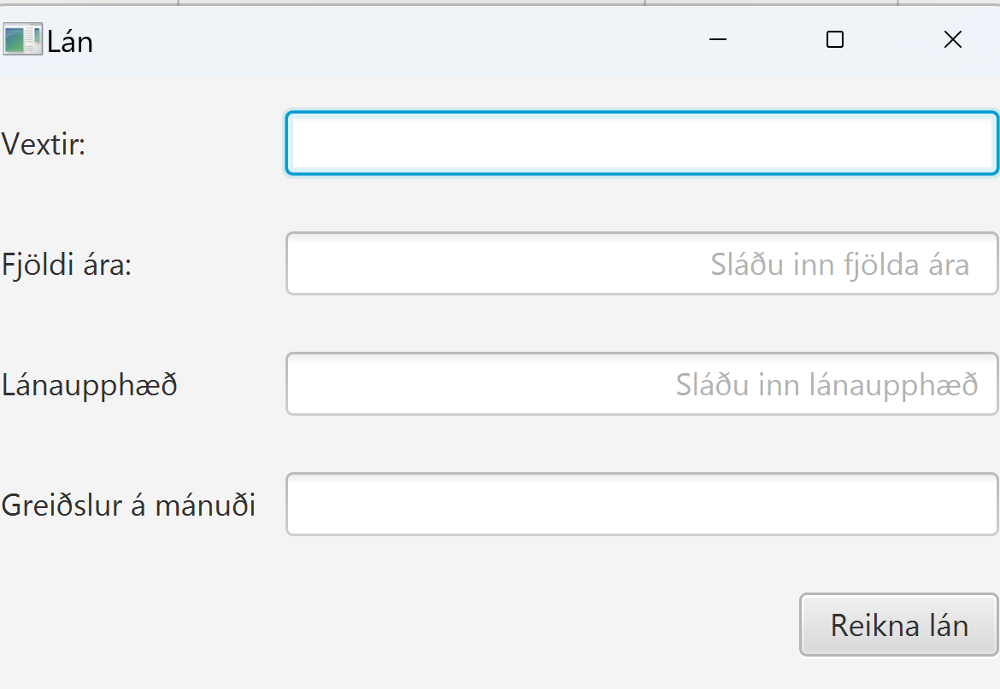

Þið eigið að forrita lánareiknivél. Notandi setur inn í textasviðin (TextField) vexti á láni,  fjölda ára sem hann/hún/það ætlar að greiða lánið upp á og og upphæð láns. Notandi setur ekki inn <enter> í lokin á textasviðunum. Þegar notandi ýtir á hnappinn  Reikna lán birtist í textasviðið greiðsla á mánuði. Ekki er hægt að breyta því textasviði. 

Eftirfarandi mynd sýnir notendaviðmót eftir að forritið er keyrt upp

og eftirfarandi mynd sýnir notendaviðmót eftir að notandinn hefur sett inn gögnin 9.4, 40 og 100000 og ýtir á Reikna lán

