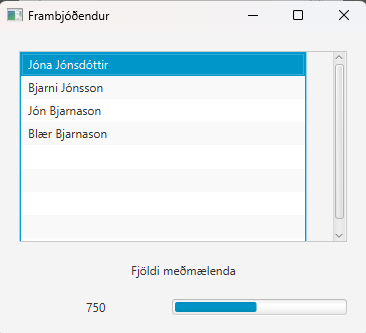
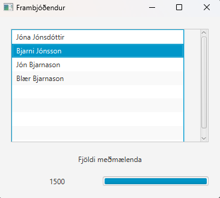

Vísbendingar eru neðst:


Forritið í þessu dæmi sýnir lista af frambjóðendum og fjölda meðmælenda sem þau hafa safnað


Myndin hér á eftir sýnir upphafsmynd forritsins í keyrslu. Framvindusláin (e. progress bar) sýnir hlutfall framvindu 
þar sem 1500 er 100%.



Í upphafi er fyrsti frambjóðandinn valinn, fjöldi meðmælenda sem hann hefur safnað og framvindusláin samkvæmt því.


Þegar notandi ýtir með mús á eitthvert atriði í listanum uppfærist fjöldi meðmælanda fyrir neðan listann og 
framvindusláin einnig. Fjöldi meðmælenda er mest 1500.



Eftirfarandi skilgreining af klasa er gefin. Ekki forrita klasann AllirFrambjodendur en þið getið kallað á aðferðina lesaFrambod()


```java
public class AllirFrambjodendur {

    /**
     * Skilar lista af Frambjodandi hlutum 
     * @return listi af Frambjodandi hlutum 
     */
    public static ObservableList<Frambjodandi> lesaFrambod()
```
Forritið FrambjodandiController. Eftirfarandi er beinagrind af klasanum.

```java
package vidmot;
// imports er sleppt - imports are omitted
public class KosningController {

// skilgreinið tilviksbreytur  // define instance variables


    // frumstilling á controller
    public void initialize() {

        // forritið hér - program here
    }

    // atburðahandler fyrir að velja atriði á lista
    @FXML
    private void onValinFrambjodandi(MouseEvent mouseEvent) {
       // forritið hér - program here
    }

    // bætið við private hjálparaðferðum sem kallað er á úr öðrum aðferðum
    // add private utility methods that are used in other methods

}
```

Forritið vinnsluklasann Frambjodandi sem hefur tilviksbreytuna nafn (strengur) og fjoldiMedmaela (int).
Hér er beinagrind

```java package vinnsla;

public class Frambjodandi {
// skilgreinið tilviksbreytur
// define instance variables

    public Frambjodandi(String nafn, int fjoldiMedmaela) {
      // forritið hér - program here
    }


// Forritið aðrar aðferðir 
// Program other methods
}

``` 
Vísbendingar:
Viðmótsklasarnir sem eru notaðir til að lýsa notendaviðmótinu í .fxml skrá
eru VBox, ScrollPane, ListView, Label, HBox, og ProgressBar